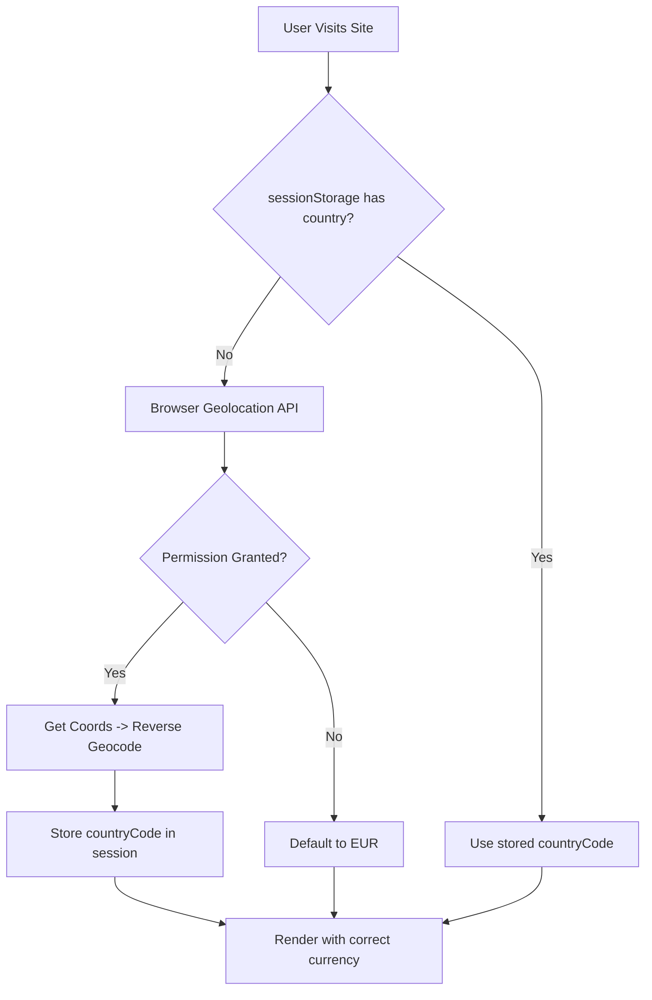

# Product Requirements Document: Client-Side Country-Based Currency Display

## 1. Introduction / Overview

This PRD defines the **client-side implementation** for displaying prices in the user's localized currency based on their detected country. The backend already supports returning prices in PLN (Poland) or EUR (rest of the world) based on the `userCountryCode` payload field.

**Key Behavior:**

- **Poland (PL)**: Display prices in **PLN** with Polish formatting (`100,00 zł`)
- **Rest of the World**: Display prices in **EUR** with Euro formatting (`€100.00`)

This feature affects the **Homepage Hero**, **Shipping Estimates page**, **Shipment Creation**, and all price displays across the marketing site.

---

## 2. Goals

1. **Automatic Country Detection**: Detect user's country via IP geolocation on first visit.
2. **Manual Override**: Allow users to manually select their country/currency preference.
3. **Dynamic Currency Formatting**: Apply locale-specific formatting conventions:
   - Poland: Symbol **after** amount (`45,99 zł`)
   - Euro: Symbol **before** amount (`€45.99`)
4. **Consistent API Integration**: Pass `userCountryCode` to all relevant API endpoints.
5. **Session Persistence**: Store preference in sessionStorage (resets per session).
6. **Homepage CTA Updates**: Update hero buttons and feature cards with functional navigation.

---

## 3. User Stories

- **US01**: As a user visiting from Poland, I want to see all prices displayed in PLN (zł) so I understand costs in my local currency.
- **US02**: As a user visiting from Germany, I want to see prices in EUR (€) so I can quickly understand shipping costs.
- **US03**: As a user, I want to manually change my country/currency preference if the auto-detection is incorrect.
- **US04**: As a user on the homepage, I want to click "Get Started" to go to the signup page.
- **US05**: As a user on the homepage, I want to click on the feature cards to navigate to relevant pages (Track Shipment, Shipping Estimates).

---

## 4. Features / Tasks

### Country Detection & State Management

- **CD01**: Integrate a free IP geolocation API (e.g., `ipapi.co` or `ip-api.com`) to detect user country on first visit.
- **CD02**: Create a `useCountryStore` Zustand store with sessionStorage persistence.
  - State: `{ countryCode: string, currency: 'PLN' | 'EUR', isManualOverride: boolean }`
  - Actions: `setCountry(code)`, `detectCountry()`, `resetToAutoDetect()`
- **CD03**: Initialize country detection in root layout or `_app` on mount.

---

### Currency Formatting Utility

- **CF01**: Create `utils/currency-formatter.ts` with a `formatCurrency(amount, currency)` function.
  - Poland (`PLN`): Format as `{amount} zł` with Polish locale (`pl-PL`).
  - Euro (`EUR`): Format as `€{amount}` with European locale (`de-DE` or `en-IE`).
- **CF02**: Create a `getCurrencySymbol(currency)` helper.
  - `PLN` → `zł`
  - `EUR` → `€`
- **CF03**: Ensure proper decimal handling (2 decimal places, correct separator).

---

### Homepage Hero Section Updates

- **HH01**: Update primary CTA button:
  - Text: "Get a Quote →" → **"Get Started →"**
  - Link: `/shipping-estimate` → **`/register`**
- **HH02**: Keep secondary CTA button:
  - Text: "Learn more"
  - Link: `/about` _(already correct)_

---

### Homepage Feature Cards (3 Cards)

- **FC01**: **Card 1 - Shipment Tracking** (Blue card):
  - "Track Now" button → Navigate to `/track-shipment`
  - "Details" button → Navigate to `/track-shipment`
- **FC02**: **Card 2 - Delivery Quote** (Purple card):
  - Update displayed price to **static `100 zł`** or **`€23`** based on detected currency.
  - "Book Now" button → Navigate to `/shipping-estimate`
  - "Compare" button → Navigate to `/shipping-estimate`
- **FC03**: **Card 3 - International Shipping** (Yellow card):
  - "Ship Global" button → Navigate to `/shipping-estimate`
  - "Learn More" button → Navigate to `/about`

---

### Shipping Estimate Page Integration

- **SE01**: Import and use `useCountryStore` to get the current `countryCode`.
- **SE02**: Pass `userCountryCode` to the `getEstimatePayload()` utility function.
- **SE03**: Display returned rates with correct currency formatting using `formatCurrency()`.
- **SE04**: Show a small country/currency indicator badge near the form or results.

---

### Shipment Creation Integration

- **SC01**: When creating a shipment (checkout flow), include `userCountryCode` in the API payload.
- **SC02**: Ensure Stripe redirects to a checkout session with the correct currency (backend handles this).

---

### Optional: Country Selector UI

- **CS01**: Add a small country selector dropdown in the header or footer.
- **CS02**: Show current detected country with flag emoji.
- **CS03**: Allow override selection from a list (Poland 🇵🇱, Other Countries 🌍).

---

## 5. Non-Goals (Out of Scope)

- **Multiple Currencies**: Only PLN and EUR are supported. No USD, GBP, etc.
- **Historical Exchange Rates**: Prices are calculated server-side at request time.
- **User Account Preferences**: Currency is session-based, not tied to user accounts.
- **Full Localization (i18n)**: Only currency formatting changes; UI text remains in English.

---

## 6. Design Considerations

### Currency Formatting Examples

| Currency | Amount | Formatted Output |
| -------- | ------ | ---------------- |
| PLN      | 100.00 | `100,00 zł`      |
| PLN      | 45.99  | `45,99 zł`       |
| EUR      | 100.00 | `€100.00`        |
| EUR      | 23.50  | `€23.50`         |

### Static Hero Card Prices

| Currency | Card 2 Display |
| -------- | -------------- |
| PLN      | `100 zł`       |
| EUR      | `€23`          |

### Country Detection Flow



---

## 7. Technical Considerations

### Geolocation Strategy

- **Primary**: `navigator.geolocation` API (Client-side).
- **Reverse Geocoding**: `api.bigdatacloud.net` (Free, Client-side) to convert Lat/Lon to Country Code.
- **Fallback**: Default to `EUR` if permission denied or API fails.
- **Note**: IP-based detection was considered but replaced by Browser Geolocation for higher accuracy and privacy consent model.

### Zustand Store Structure

```typescript
interface CountryState {
  countryCode: string; // ISO 3166-1 alpha-2 (e.g., 'PL', 'DE')
  currency: "PLN" | "EUR";
  isDetected: boolean;
  isManualOverride: boolean;
  setCountry: (code: string) => void;
  detectCountry: () => Promise<void>;
}
```

### Files to Create/Modify

| Action   | File                                           |
| -------- | ---------------------------------------------- |
| [NEW]    | `store/country-store.ts`                       |
| [NEW]    | `utils/currency-formatter.ts`                  |
| [MODIFY] | `components/home/hero.tsx`                     |
| [MODIFY] | `app/(marketing)/shipping-estimate/page.tsx`   |
| [MODIFY] | `app/(marketing)/shipping-estimate/utils.ts`   |
| [MODIFY] | `hooks/shipments/use-shipments.ts` (if needed) |

---

## 8. Success Metrics

- ✅ Users in Poland see prices in `zł` format.
- ✅ Users outside Poland see prices in `€` format.
- ✅ Homepage hero CTAs navigate to correct pages.
- ✅ Feature cards are fully interactive with correct routing.
- ✅ Shipping estimates display currency returned by API.
- ✅ `userCountryCode` is passed in all estimate/shipment requests.

---

## 9. Verification Plan

### Automated Tests

- Unit tests for `formatCurrency()` utility with PLN and EUR inputs.
- Unit tests for `useCountryStore` state transitions.

### Manual Verification

1. **Poland Detection**: Use VPN or IP spoofer to simulate Polish IP → Verify `zł` formatting.
2. **Non-Poland Detection**: Default browser → Verify `€` formatting.
3. **Homepage Navigation**: Click all hero CTAs and card buttons → Verify correct routes.
4. **Shipping Estimate Flow**: Get a quote → Verify currency matches detected country.
5. **Session Persistence**: Refresh page → Verify country preference persists.

---

## 10. Open Questions

- **Q1**: Should there be a visible country/currency toggle in the UI, or is auto-detection + session storage sufficient?
  - **Answer**: Auto-detection with manual override option (selector in header/footer).

- **Q2**: What fallback should be used if IP geolocation fails?
  - **Answer**: Default to `EUR` (most common for European users).
